### ArrayList底层结构和源码分析

#### 1.增加元素

- ArrayList中维护了一个Object类型的数组elementData

  ```java
  transient Object[] elementData;
  ```

  trainsient关键字修饰的变量不会被序列化。

- 当创建ArrayList对象时，如果使用的是无参构造器，则初始elementData容量为0，第1次添加时，扩容elementData为10，如果需要再次扩容，则扩容elementData当前容量的1.5倍。10个元素的1.5倍也就是15。

- 如果使用的是指定大小的构造器，则初始elementData容量为指定大小，如需扩容，则直接扩容为elementData的1.5倍。例如：初始化容量为8，添加满8个之后，按照8 * 1.5 = 12 个扩容。

- 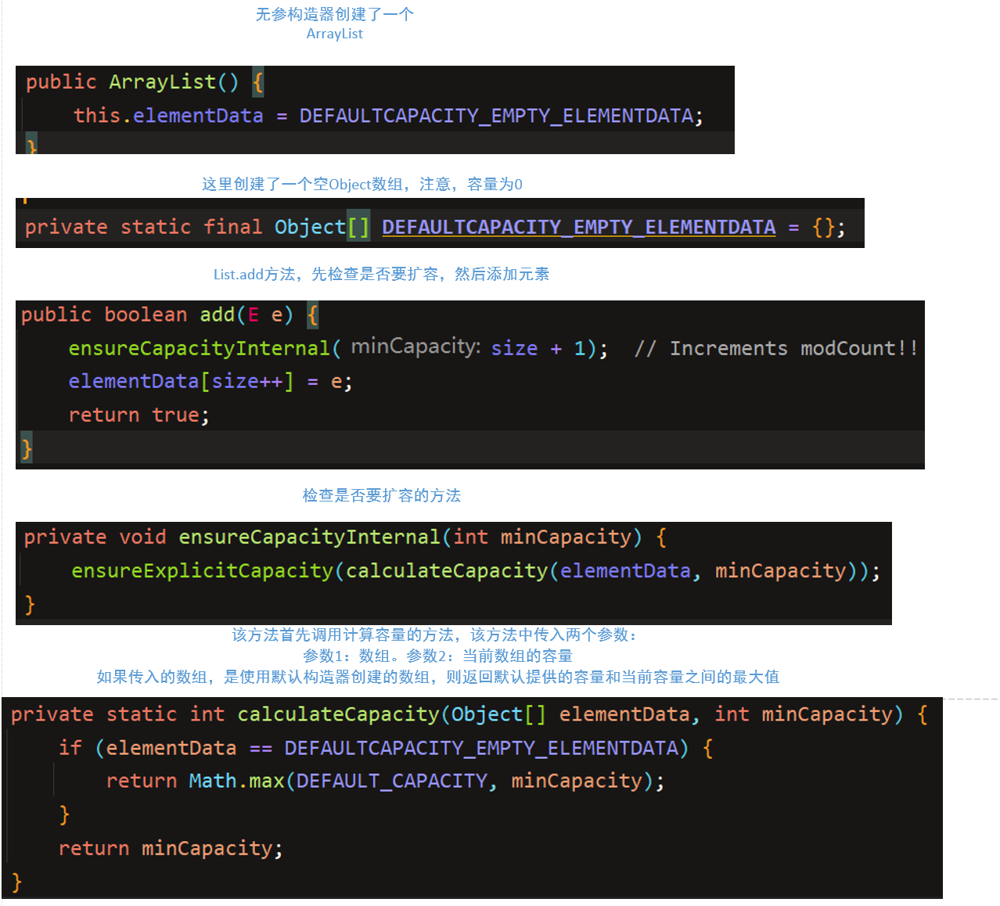

  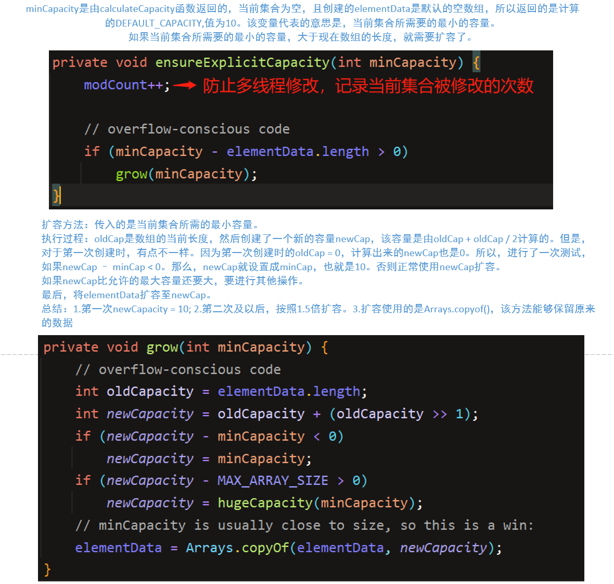
  

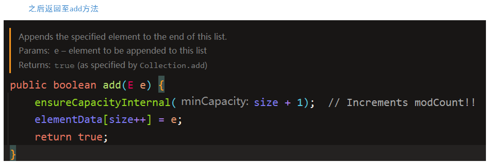

计算所需容量 -> 判断是否扩容 -> 扩容/不扩容 -> 执行添加操作

#### 2 获取元素

list.get(x)

```java
public E get(int index) {
    rangeCheck(index);

    return elementData(index);
}
//先调用范围检查rangeCheck(index)
private void rangeCheck(int index) {
    if (index >= size)
        throw new IndexOutOfBoundsException(outOfBoundsMsg(index));
}
//范围检查通过，调用elementData(index)
E elementData(int index) {
    return (E) elementData[index];
}

```

#### 3.修改元素

list.set(index,element)

```java
public E set(int index, E element) {
    //范围检查
    rangeCheck(index);
	//获取index位置上的旧元素
    E oldValue = elementData(index);
    //将index位置上的元素设置为新元素
    elementData[index] = element;
    //返回旧元素
    return oldValue;
}
```

#### 4.删除元素

按位置删除。

```java
public E remove(int index) {
    //范围检查
    rangeCheck(index);
	//修改次数增加
    modCount++;
    //按位置找到要删除的元素
    E oldValue = elementData(index);
	//计算删除元素后，从被删除元素开始，到最后一个元素之间有多少个元素
    int numMoved = size - index - 1;
    if (numMoved > 0)
        //将被删除元素之后的元素统一向前移动一位
        System.arraycopy(elementData, index+1, elementData, index,
                         numMoved);
    //将最后一个元素设置为null，将其GC
    elementData[--size] = null; // clear to let GC do its work
	//返回被删除元素
    return oldValue;
}
```

按对象删除

```java
public boolean remove(Object o) {
    //如果要删除的对象是null
    if (o == null) {
        for (int index = 0; index < size; index++)
            //在数组中找到第一个为null的元素，并记录其位置。
            if (elementData[index] == null) {
                //然后按位置删除
                fastRemove(index);
                return true;
            }
    } else {
        for (int index = 0; index < size; index++)
            //否则在数组中找到第一个与该元素相等的元素，并记录其位置
            if (o.equals(elementData[index])) {
                //按位置删除
                fastRemove(index);
                return true;
            }
    }
    return false;
}
private void fastRemove(int index) {
    modCount++;
    int numMoved = size - index - 1;
    if (numMoved > 0)
        System.arraycopy(elementData, index+1, elementData, index,
                         numMoved);
    elementData[--size] = null; // clear to let GC do its work
}
```


### Vector底层结构和源码剖析

- ```java
  public class Vector<E> extends AbstractList<E> implements List<E>,RandomAccess,Cloneable,Serializable
  ```

- Vector底层也是一个对象数组，protected Object[] elementData;

- Vector是线程同步的，即线程安全的，Vector类的操作方法带有synchronized

- 在开发中，需要线程同步安全时，需要考虑Vector

- 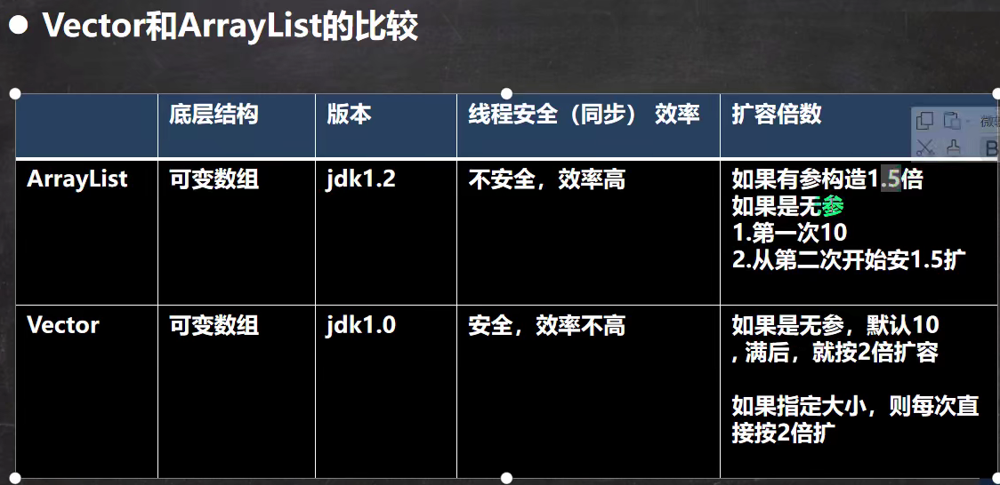

- 源码分析和ArrayList类似，源码也和ArrayList类似
  核心的扩容算法如下:

  ```java
  private void grow(int minCapacity) {
      // overflow-conscious code
      int oldCapacity = elementData.length;
      //如果capacityIncrement > 0 不成立，空间扩大二倍
      int newCapacity = oldCapacity + ((capacityIncrement > 0) ?
                                       capacityIncrement : oldCapacity);
      if (newCapacity - minCapacity < 0)
          newCapacity = minCapacity;
      if (newCapacity - MAX_ARRAY_SIZE > 0)
          newCapacity = hugeCapacity(minCapacity);
      elementData = Arrays.copyOf(elementData, newCapacity);
  }
  ```

### LinkedList说明

- LinkedList底层实现了双向链表和双端队列的特点

- 可以添加任意元素（元素可以重复），包括null

- 线程不安全，没有实现同步机制。

- LinkedList中维护了两个属性first和last，分别指向首节点和尾节点

  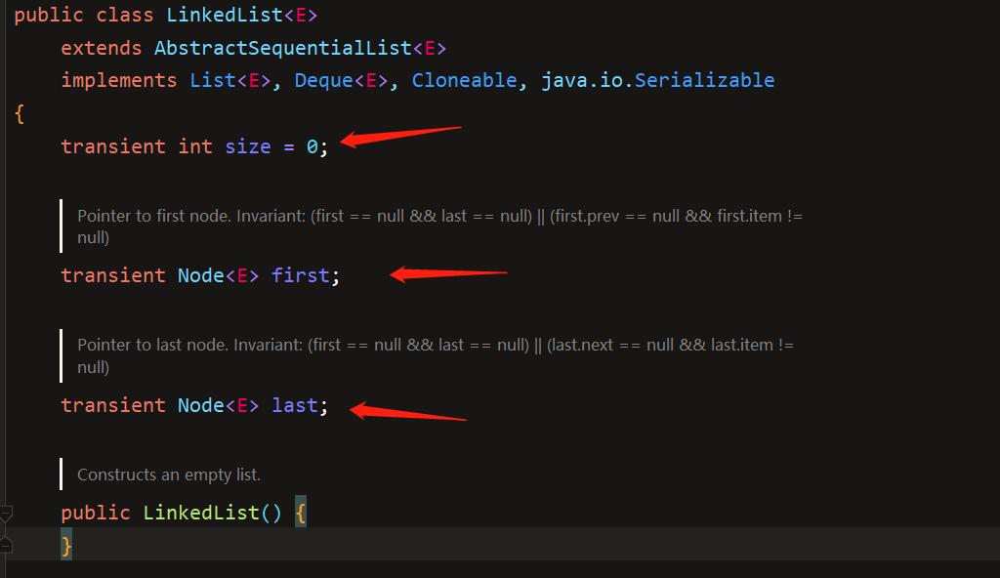

- 每个节点（Node对象），里面又维护了prev，next，item三个属性，其中通过prev指向前一个，通过next指向后一个节点。最终实现双向链表
  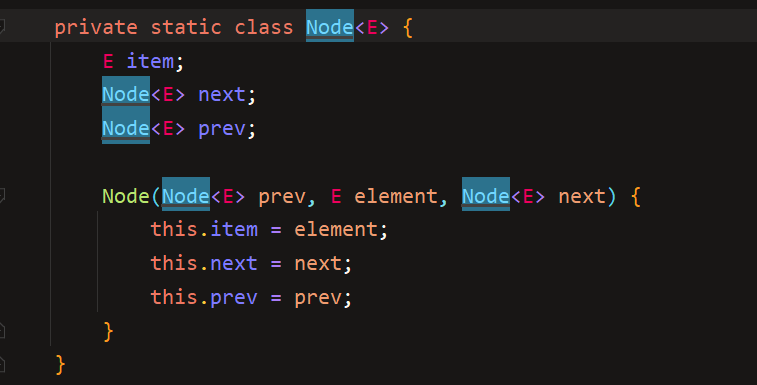

- 所以，LinkedList的元素的添加和删除，不是通过数组完成的，相对来说，效率较高。

- 模拟一个简单的双向链表
  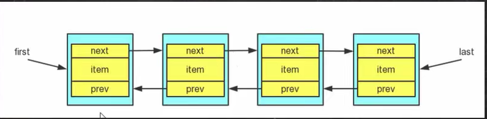

- ```java
  public class LinkedListUnderlying {
      public static void main(String[] args) {
          LinkedList<Integer> linkedList = new LinkedList<>();
          /**
           * public LinkedList() {
           *     }
           * 这时list的first(指向链表的头) = null,last(指向链表的尾) = null,size = 0
           */
          linkedList.add(1);
          /**
           * public boolean add(E e) {
           *         linkLast(e);
           *         return true;
           * }
           * void linkLast(E e) {
           *     //此时list的last为null  l也就相应的为null
       *         final Node<E> l = last;
       *         final Node<E> newNode = new Node<>(l, e, null);
       *         //list的last指向新创建的节点newNode
       *         last = newNode;
       *         //l此时为null
       *         if (l == null)
       *         //list的first也指向新创建的节点newNode
       *             first = newNode;
       *         else
       *             l.next = newNode;
       *         //list的size++
       *         size++;
       *         //list被修改的次数++
       *         modCount++;
       *     }
           */
          linkedList.add(2);
          /**
           * void linkLast(E e) {
           *     //创建一个引用l指向list中last所指向的对象，本例中为 1
       *         final Node<E> l = last;
           *     //创建一个新的节点，新节点的prev为l，也就是1.新节点的值为e，本例为2。新节点的next为null。
       *         final Node<E> newNode = new Node<>(l, e, null);
           *     //list的last从原来的指向断开，指向新创建的节点newNode
       *         last = newNode;
           *     //l这里指向的是原来的last，也就是1,所以肯定不为null
       *         if (l == null)
       *             first = newNode;
           *     //走到这里，l现在指向的是原来last指向的节点1，然后l的next指向新创建的节点newNode
       *         else
       *             l.next = newNode;
           *     //size + 1
       *         size++;
       *         modCount++;
       *     }
           */
          linkedList.add(3);
          linkedList.remove(2);
          /**
           * public E remove(int index) {
       *         checkElementIndex(index);
       *         return unlink(node(index));
       *     }
           * //找到位于index位置的node
           * Node<E> node(int index) {
       *         // assert isElementIndex(index);
           *     // 以size / 2为中间基准。
       *         // 如果要找的Node在左边
           *     //因为first指向list的头节点，从first开始往后找
       *         if (index < (size >> 1)) {
       *             Node<E> x = first;
       *             for (int i = 0; i < index; i++)
       *                 x = x.next;
       *             return x;
       *         } else {
           *     //否则，从last从后往前找
       *             Node<E> x = last;
       *             for (int i = size - 1; i > index; i--)
       *                 x = x.prev;
       *             return x;
       *         }
       *     }
           *     经典双向链表删除算法
       * E unlink(Node<E> x) {
       *         // assert x != null;
       *         final E element = x.item;
       *         final Node<E> next = x.next;
       *         final Node<E> prev = x.prev;
       *
       *         if (prev == null) {
       *             first = next;
       *         } else {
       *             prev.next = next;
       *             x.prev = null;
       *         }
       *
       *         if (next == null) {
       *             last = prev;
       *         } else {
       *             next.prev = prev;
       *             x.next = null;
       *         }
       *
       *         x.item = null;
       *         size--;
       *         modCount++;
       *         return element;
       *     }
           */
          linkedList.removeFirst();
          /**
           *
           * 删除头节点
           * public E removeFirst() {
       *         final Node<E> f = first;
       *         if (f == null)
       *             throw new NoSuchElementException();
       *         return unlinkFirst(f);
       *     }
       * private E unlinkFirst(Node<E> f) {
   *         // assert f == first && f != null;
   *         final E element = f.item;
   *         final Node<E> next = f.next;
           * //元素置空
   *         f.item = null;
           * //元素的下个元素置空
   *         f.next = null; // help GC
           * //移动头元素
   *         first = next;
           * //如果f的next也为null，那么list成为了空链表，置list的last也为空
   *         if (next == null)
   *             last = null;
   *         else
   *             next.prev = null;
   *         size--;
   *         modCount++;
   *         return element;
   *     }
           */
          linkedList.set(1,999);
          /**
           * 找到位于x的节点，然后修改它的值
           * public E set(int index, E element) {
       *         checkElementIndex(index);
       *         Node<E> x = node(index);
       *         E oldVal = x.item;
       *         x.item = element;
       *         return oldVal;
       *     }
           */
          System.out.println(linkedList);
      }
  }
  ```

### HashSet原理说明

- HashSet实现了Set接口

- HashSet实际上是HashMap

- ```java
  public HashSet() {
      map = new HashMap<>();
  }
  ```

- hashSet可以存放null值，但是只能有一个null值

- HashSet不保证元素是有序的，取决于hash之后，再确定索引的结果。即，不保证存放元素的顺序和取出顺序的一致性。

- 不能有重复元素/对象。

- 一个经典问题

  ```java
  public class HashSetUnderlying {
      public static void main(String[] args) {
          HashSet hashSet = new HashSet();
          hashSet.add("lucky");   //加入成功
          hashSet.add("lucky");   //加入失败
          hashSet.add(new Student("Echo")); //加入成功
          hashSet.add(new Student("Echo")); //加入成功
          hashSet.add(new String("SXS")); //加入成功
          hashSet.add(new String("SXS")); //加入失败,虽然这里是添加了一个String对象，但是还是加入失败的
          System.out.println(hashSet);
      }
  }
  ```

  ```bash
  [lucky, com.proxyStudy.staticProxy.Student@4554617c, com.proxyStudy.staticProxy.Student@1b6d3586, SXS]
  ```

- HashSet实际上是HashMap,HashMap底层是（数组+链表+红黑树），当链表的容量达到一定范围，且数组的大小也达到一定范围，就会将链表变为红黑树。

- HashSet底层原理
  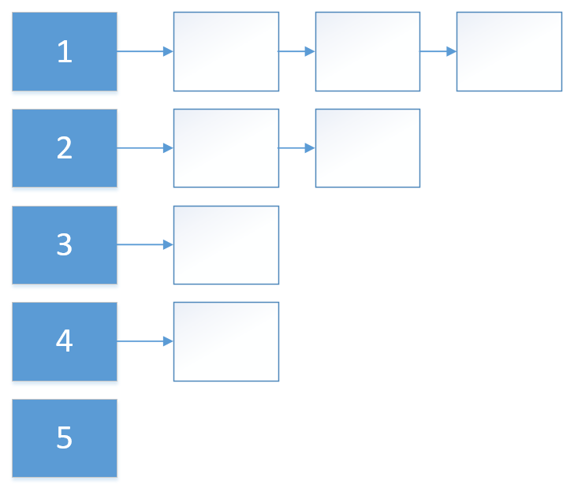

  - HashSet底层是HashMap
  - 添加一个元素时，会先得到hash值，该hash转换成hash表（数组+链表构成的桶）的索引
  - 找到存储数据的hash表，看这个索引的位置是否有元素。
  - 如果没有，直接加入
  - 如果有，调用equals比较，如果相同，放弃添加，如果不同，添加到最后
  - 在Java8中，如果一条链表的元素个数到达TREEIFY-THRESHOLD（默认是8）,且hash表的大小 >= MIN_TREFIFY_CAPACITY(默认64)，就会进行树化（红黑树）

- ```java
  public class HashSetUnderlying {
      public static void main(String[] args) {
  //        HashSet hashSet = new HashSet();
  //        hashSet.add("lucky");   //加入成功
  //        hashSet.add("lucky");   //加入失败
  //        hashSet.add(new Student("Echo")); //加入成功
  //        hashSet.add(new Student("Echo")); //加入成功
  //        hashSet.add(new String("SXS")); //加入成功
  //        hashSet.add(new String("SXS")); //加入失败,虽然这里是添加了一个String对象，但是还是加入失败的
  //        System.out.println(hashSet);
          HashSet hashSet = new HashSet();
          /**
           * 1.执行构造器
           * public HashSet() {
       *         map = new HashMap<>();
       *     }
           */
          hashSet.add("java");
          /**
           * public boolean add(E e) {
           *     //这个PRESENT是一个：private static final Object PRESENT = new Object();  用来占位的东西
       *         return map.put(e, PRESENT)==null;
           *
       *     }
           * //调用put方法
           * public V put(K key, V value) {
       *         return putVal(hash(key), key, value, false, true);
       *     }
           * //先调用hash(key)计算key 的hash值
           * static final int hash(Object key) {
       *         int h;
       *         return (key == null) ? 0 : (h = key.hashCode()) ^ (h >>> 16);
       *     }
           * //然后调用putVal方法
           * final V putVal(int hash, K key, V value, boolean onlyIfAbsent,
       *                    boolean evict) {
           *     //1.定义辅助变量
       *         Node<K,V>[] tab; Node<K,V> p; int n, i;
           *     //2.table是hash表，是一个Node<K,V>[]. 判断table是否为null，或者table的长度是否为0
       *         if ((tab = table) == null || (n = tab.length) == 0)
           *         //执行第一次扩容，扩容至16个空间
           *         //resize()是扩容方法。
       *             n = (tab = resize()).length;
           *     //根据由key得到hash值，计算该key应该存放到hash表的哪个位置。并把这个位置的对象，赋值给p
           *     //并判断p是否为空
       *         if ((p = tab[i = (n - 1) & hash]) == null)
           *         //如果p为空，那么证明该位置没有存放元素，就创建一个Node,将hash(key),key,固定的值PRESENT,以及next传入
       *             tab[i] = newNode(hash, key, value, null);
       *         else {
       *             Node<K,V> e; K k;
       *             if (p.hash == hash &&
       *                 ((k = p.key) == key || (key != null && key.equals(k))))
       *                 e = p;
       *             else if (p instanceof TreeNode)
       *                 e = ((TreeNode<K,V>)p).putTreeVal(this, tab, hash, key, value);
       *             else {
       *                 for (int binCount = 0; ; ++binCount) {
       *                     if ((e = p.next) == null) {
       *                         p.next = newNode(hash, key, value, null);
       *                         if (binCount >= TREEIFY_THRESHOLD - 1) // -1 for 1st
       *                             treeifyBin(tab, hash);
       *                         break;
       *                     }
       *                     if (e.hash == hash &&
       *                         ((k = e.key) == key || (key != null && key.equals(k))))
       *                         break;
       *                     p = e;
       *                 }
       *             }
       *             if (e != null) { // existing mapping for key
       *                 V oldValue = e.value;
       *                 if (!onlyIfAbsent || oldValue == null)
       *                     e.value = value;
       *                 afterNodeAccess(e);
       *                 return oldValue;
       *             }
       *         }
       *         ++modCount;
           *     //看看添加一个元素之后的容量是否超过了由装载因子 * 当前容量计算出来的阈值。
       *         if (++size > threshold)
           *         //如果超过了，就扩容
       *             resize();
       *         afterNodeInsertion(evict);
           *     //返回null代表插入成功，如果不是null，就证明元素重复了，返回重复的元素
       *         return null;
       *     }
           * final Node<K,V>[] resize() {
       *         Node<K,V>[] oldTab = table;
       *         int oldCap = (oldTab == null) ? 0 : oldTab.length;
       *         int oldThr = threshold;
       *         int newCap, newThr = 0;
       *         if (oldCap > 0) {
       *             if (oldCap >= MAXIMUM_CAPACITY) {
       *                 threshold = Integer.MAX_VALUE;
       *                 return oldTab;
       *             }
       *             else if ((newCap = oldCap << 1) < MAXIMUM_CAPACITY &&
       *                      oldCap >= DEFAULT_INITIAL_CAPACITY)
       *                 newThr = oldThr << 1; // double threshold
       *         }
       *         else if (oldThr > 0) // initial capacity was placed in threshold
       *             newCap = oldThr;
       *         else {               // zero initial threshold signifies using defaults
           *         //如果oldCap=0,也就是初始时，hash表为空。
           *         //那么newCap = DEFAULT_INITIAL_CAPACITY = 16;
       *             newCap = DEFAULT_INITIAL_CAPACITY;
           *         //newThr = DEFAULT_LOAD_FACTOR * DEFAULT_INITIAL_CAPACITY
           *         //其中DEFAULT_LOAD_FACTOR是装载因子。默认为0.75.
           *         //也就是，当阈值达到0.75 * 16 = 12时，就会扩容，这种机制是为了缓冲。
       *             newThr = (int)(DEFAULT_LOAD_FACTOR * DEFAULT_INITIAL_CAPACITY);
           *
       *         }
       *         if (newThr == 0) {
       *             float ft = (float)newCap * loadFactor;
       *             newThr = (newCap < MAXIMUM_CAPACITY && ft < (float)MAXIMUM_CAPACITY ?
       *                       (int)ft : Integer.MAX_VALUE);
       *         }
       *         threshold = newThr;
       *         @SuppressWarnings({"rawtypes","unchecked"})
       *         Node<K, V>[] newTab = (Node<K,V>[])new Node[newCap];
       *         table = newTab;
       *         if (oldTab != null) {
       *             for (int j = 0; j < oldCap; ++j) {
       *                 Node<K,V> e;
       *                 if ((e = oldTab[j]) != null) {
       *                     oldTab[j] = null;
       *                     if (e.next == null)
       *                         newTab[e.hash & (newCap - 1)] = e;
       *                     else if (e instanceof TreeNode)
       *                         ((TreeNode<K,V>)e).split(this, newTab, j, oldCap);
       *                     else { // preserve order
       *                         Node<K,V> loHead = null, loTail = null;
       *                         Node<K,V> hiHead = null, hiTail = null;
       *                         Node<K,V> next;
       *                         do {
       *                             next = e.next;
       *                             if ((e.hash & oldCap) == 0) {
       *                                 if (loTail == null)
       *                                     loHead = e;
       *                                 else
       *                                     loTail.next = e;
       *                                 loTail = e;
       *                             }
       *                             else {
       *                                 if (hiTail == null)
       *                                     hiHead = e;
       *                                 else
       *                                     hiTail.next = e;
       *                                 hiTail = e;
       *                             }
       *                         } while ((e = next) != null);
       *                         if (loTail != null) {
       *                             loTail.next = null;
       *                             newTab[j] = loHead;
       *                         }
       *                         if (hiTail != null) {
       *                             hiTail.next = null;
       *                             newTab[j + oldCap] = hiHead;
       *                         }
       *                     }
       *                 }
       *             }
       *         }
       *         return newTab;
       *     }
           */
          hashSet.add("php");
          /**
           * 第二次添加元素
           * public boolean add(E e) {
       *         return map.put(e, PRESENT)==null;
       *     }
           * public V put(K key, V value) {
       *         return putVal(hash(key), key, value, false, true);
       *     }
           * static final int hash(Object key) {
       *         int h;
       *         return (key == null) ? 0 : (h = key.hashCode()) ^ (h >>> 16);
       *     }
           *final V putVal(int hash, K key, V value, boolean onlyIfAbsent,
           *                    boolean evict) {
       *         Node<K,V>[] tab; Node<K,V> p; int n, i;
       *         if ((tab = table) == null || (n = tab.length) == 0)
       *             n = (tab = resize()).length;
       *         if ((p = tab[i = (n - 1) & hash]) == null)
       *             tab[i] = newNode(hash, key, value, null);
       *         else {
       *             Node<K,V> e; K k;
       *             if (p.hash == hash &&
       *                 ((k = p.key) == key || (key != null && key.equals(k))))
       *                 e = p;
       *             else if (p instanceof TreeNode)
       *                 e = ((TreeNode<K,V>)p).putTreeVal(this, tab, hash, key, value);
       *             else {
       *                 for (int binCount = 0; ; ++binCount) {
       *                     if ((e = p.next) == null) {
       *                         p.next = newNode(hash, key, value, null);
       *                         if (binCount >= TREEIFY_THRESHOLD - 1) // -1 for 1st
       *                             treeifyBin(tab, hash);
       *                         break;
       *                     }
       *                     if (e.hash == hash &&
       *                         ((k = e.key) == key || (key != null && key.equals(k))))
       *                         break;
       *                     p = e;
       *                 }
       *             }
       *             if (e != null) { // existing mapping for key
       *                 V oldValue = e.value;
       *                 if (!onlyIfAbsent || oldValue == null)
       *                     e.value = value;
       *                 afterNodeAccess(e);
       *                 return oldValue;
       *             }
       *         }
       *         ++modCount;
       *         if (++size > threshold)
       *             resize();
       *         afterNodeInsertion(evict);
       *         return null;
       *     }
           */
          hashSet.add("java");
          /**
           * 添加一个重复的元素（不再进行上述分析的步骤，直接看putVal方法)
           * final V putVal(int hash, K key, V value, boolean onlyIfAbsent,
           *                    boolean evict) {
       *         Node<K,V>[] tab; Node<K,V> p; int n, i;
       *         if ((tab = table) == null || (n = tab.length) == 0)
       *             n = (tab = resize()).length;
       *         if ((p = tab[i = (n - 1) & hash]) == null)
       *             tab[i] = newNode(hash, key, value, null);
       *         else {
           *         //辅助变量
       *             Node<K,V> e; K k;
           *         //如果当前索引位置对应的链表的第一个元素和准备添加的key的hash值相同且p中的key和准备添加的key是同一个对象（对引用类型来说）或者值相同（对基本类型来说）
       *             if (p.hash == hash &&
       *                 ((k = p.key) == key || (key != null && key.equals(k))))
           *             //e也指向p，不能加入
       *                 e = p;
           *         //如果上述条件不满足。判断p是否一个红黑树，如果是一颗红黑树，就按照红黑树的方法添加
       *             else if (p instanceof TreeNode)
       *                 e = ((TreeNode<K,V>)p).putTreeVal(this, tab, hash, key, value);
       *             else {
           *         //如果上述条件也不满足，因为p指向的是头节点，从头节点开始往后依次遍历，如果找到元素已经存在了，就不添加
           *         //否则就将新元素添加到链表的最尾部。
           *         //如果添加后，链表的长度 >= 阈值 8，就将当前的这条链表，进行红黑树变换。注意，在进行红黑树变换时，还需要
           *         //判断hash表的长度是否超过了最大阈值64，如果没有超过，只是进行扩容操作，而不是树化操作，它认为扩容操作也
           *         //可以解决hash碰撞。
           *         //if (tab == null || (n = tab.length) < MIN_TREEIFY_CAPACITY)
           *         //    resize();
           *
       *                 for (int binCount = 0; ; ++binCount) {
       *                     if ((e = p.next) == null) {
       *                         p.next = newNode(hash, key, value, null);
       *                         if (binCount >= TREEIFY_THRESHOLD - 1) // -1 for 1st
       *                             treeifyBin(tab, hash);
       *                         break;
       *                     }
       *                     if (e.hash == hash &&
       *                         ((k = e.key) == key || (key != null && key.equals(k))))
       *                         break;
       *                     p = e;
       *                 }
       *             }
           *         //如果e不为空，就证明元素已经存在，返回存在的元素
       *             if (e != null) { // existing mapping for key
       *                 V oldValue = e.value;
       *                 if (!onlyIfAbsent || oldValue == null)
       *                     e.value = value;
       *                 afterNodeAccess(e);
       *                 return oldValue;
       *             }
       *         }
       *         ++modCount;
       *         if (++size > threshold)
       *             resize();
       *         afterNodeInsertion(evict);
       *         return null;
       *     }
           *
           */
          System.out.println("set=" + hashSet);
      }
  }
  ```

- 树化结论：

  - HashSet底层使用的是HashMap，第一次添加时，table数组扩容到16，临界值（threshold)是16*加载因子（loalFactory)0.75 = 12
  - 如果table数组使用到了临界值12，就会扩容到16 * 2 = 32，新的临界值就是32*0.75 = 24，依次类推。
  - 在Java 8 中，如果一条链表的元素的个数到达TREEIFY_THRESHOLD(默认是8)，并且table的大小 >= MIN_TREEIFY_CAPACITY(默认采用64)，就会进行树化（红黑树），否则仍然采用数组扩容机制，即容量直接翻倍（即时没有到达阈值）。

### LinkedHashSet原理

- LinkedHashSet是HashSet的子类
- LinkedHashSet底层是一个LinkedHashMap，底层维护了一个数组+双向链表
- LinkedHashSet根据元素的hashCode值来决定元素的存储位置，同时使用链表维护元素的次序，这使得元素看起来是以插入顺序保存的
- LinkedHashSet不允许添加重复元素。
- 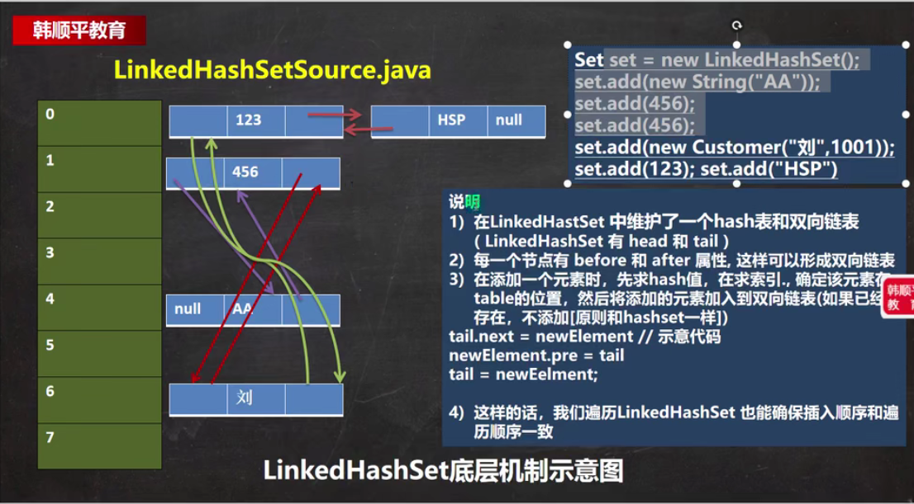
- 在LinkedHashSet中维护了一个hash表和双向链表（LinkedHashSet有head和tail)
- 每一个节点有before和after属性，用来维护双向链表
- 添加一个元素时，首先求出hash值，然后求出该hash值对应的桶的索引，然后确定该元素在桶中的位置（如果已有，则不添加），加入桶中之后，同时维护好双向链表，保证有序。
- 这样在遍历时，通过before和after属性，维护了LinkedHashSet的有序性。


### Map原理

- k-v结构最后是由 HashMap$Node node = new Node(hash,key,value,null)体现的。

- 为了程序员遍历Map,会创建EntrySet集合，该集合中存放的元素类型是Entry,而一个Entry对象有K，V。
  EntrySet<Entry<K,V>>,即：transient Set<Map.Entry<K,V>> entrySet;  一个Entry中并没有放实际的元素。而是存放的实际元素的引用，Entry中的K指向实际存储元素的Key,Entry中的V指向实际存储元素的Value。

- entrySet中，定义的类型是Map.Entry，但实际上存放的还是HashMap$Node, 这是因为
  static class Node<K,V> implements Map.Entry<K,V>

- 当把HashMap$Node对象存放到entrySet就方便我们的遍历，因为Map.Entry提供了K getKey()和
  V getValue()方法。

- 自己看源码吧，他没有讲清楚，但是关键是这个Iterator

  ```java
  abstract class HashIterator {
          Node<K,V> next;        // next entry to return
          Node<K,V> current;     // current entry
          int expectedModCount;  // for fast-fail
          int index;             // current slot
  
          HashIterator() {
              expectedModCount = modCount;
              Node<K,V>[] t = table;
              current = next = null;
              index = 0;
              if (t != null && size > 0) { // advance to first entry
                  do {} while (index < t.length && (next = t[index++]) == null);
              }
          }
  
          public final boolean hasNext() {
              return next != null;
          }
  
          final Node<K,V> nextNode() {
              Node<K,V>[] t;
              Node<K,V> e = next;
              if (modCount != expectedModCount)
                  throw new ConcurrentModificationException();
              if (e == null)
                  throw new NoSuchElementException();
              if ((next = (current = e).next) == null && (t = table) != null) {
                  do {} while (index < t.length && (next = t[index++]) == null);
              }
              return e;
          }
  
          public final void remove() {
              Node<K,V> p = current;
              if (p == null)
                  throw new IllegalStateException();
              if (modCount != expectedModCount)
                  throw new ConcurrentModificationException();
              current = null;
              K key = p.key;
              removeNode(hash(key), key, null, false, false);
              expectedModCount = modCount;
          }
      }
  ```

  实际上是通过构造迭代器，然后实现对Map的遍历，只不过是对取出来的元素用Entry又封了一下

### HashMap底层原理

- 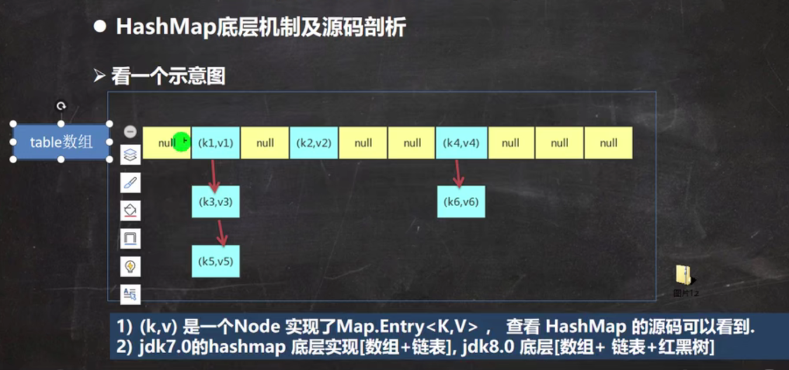

- 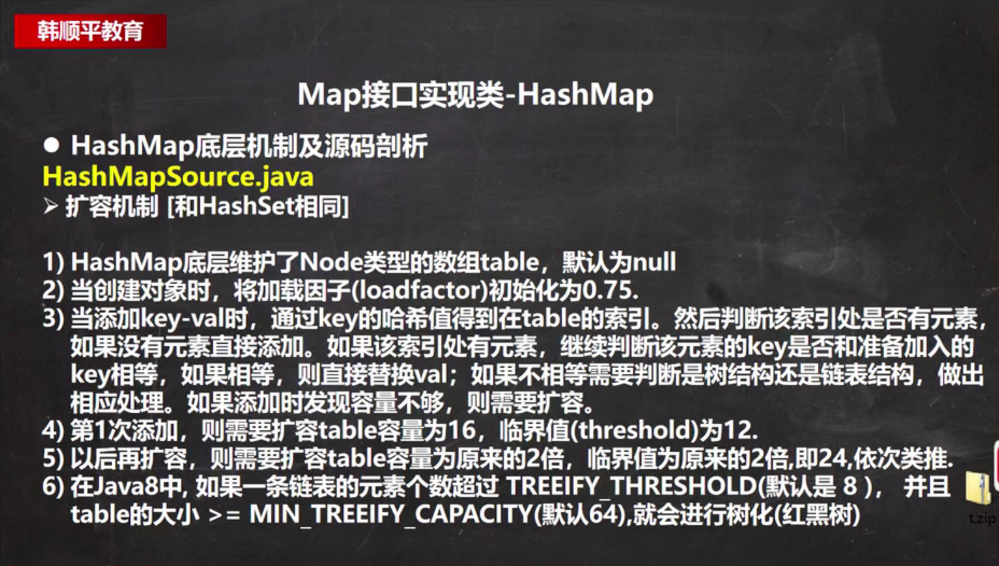

- ```java
  public class HashMapUnderlying {
      public static void main(String[] args) {
          HashMap hashMap = new HashMap();
          /**
           * //1.构造器，注意，构造器里面只是初始化了加载因子，并没有实际开辟空间
           * // HashMap$Node[] table = null
           * public HashMap() {
       *         this.loadFactor = DEFAULT_LOAD_FACTOR; // all other fields defaulted 0.75
       *     }
           *
           */
          hashMap.put("java",10);
          /**
           * //2.执行put方法
           * public V put(K key, V value) { //key = "java" value = 10
       *         return putVal(hash(key), key, value, false, true);
       *     }
           * //3.调用hash(key) 计算key的hash值
           * static final int hash(Object key) {
       *         int h;
       *         return (key == null) ? 0 : (h = key.hashCode()) ^ (h >>> 16);
       *     }
           * //4.执行putVal
           * final V putVal(int hash, K key, V value, boolean onlyIfAbsent,
           *                    boolean evict) {
       *         Node<K,V>[] tab; Node<K,V> p; int n, i;
           *     //如果table为null或者table的长度为0
       *         if ((tab = table) == null || (n = tab.length) == 0)
           *         //执行resize()方法并返回长度
       *             n = (tab = resize()).length;
           *     //通过传入的hash值和table的长度做与运算，计算传入的值应该放在的位置
       *         if ((p = tab[i = (n - 1) & hash]) == null)
           *         //如果计算得到的数组（桶）的第一个元素是空的，那么就把创建一个新的Node,把key-value传进去，挂到桶的第一个位置。
       *             tab[i] = newNode(hash, key, value, null);
       *         else {
           *         //否则，（也就是计算得到的要插入的桶，该桶的第一个元素不为null)
       *             Node<K,V> e; K k;
           *         //先和桶的头节点比较
       *             if (p.hash == hash &&
       *                 ((k = p.key) == key || (key != null && key.equals(k))))
           *             //如果，桶的头节点的hash值和计算出来得到的hash相同，头节点的key和传入的key值相同(基本数据类型)或引用相同(引用类型)
           *             //将头节点p的值赋值给e。 e是要返回的。
       *                 e = p;
       *             else if (p instanceof TreeNode)
           *             //否则，如果这个p是一个树节点，即hashmap已经红黑树化了。进行红黑树的判断
       *                 e = ((TreeNode<K,V>)p).putTreeVal(this, tab, hash, key, value);
       *             else {
           *             //否则，即与头节点不相同。开始向后遍历
       *                 for (int binCount = 0; ; ++binCount) {
           *                 //如果桶的头节点的下一个节点，即p.next为空。
       *                     if ((e = p.next) == null) {
           *                     //直接创建新的Node，将值传入，挂上去
       *                         p.next = newNode(hash, key, value, null);
           *                     //挂完之后，还要判断，该桶的大小是不是已经到了可以树化的阈值(8)
       *                         if (binCount >= TREEIFY_THRESHOLD - 1) // -1 for 1st
           *                         //如果是，则判断是否要树化。树化必须达到，桶的个数为64个，且有一个桶内的元素数量超过了阈值8
           *                         //这里需要注意的是，并不是一个桶中只能装阈值(8)个元素。如果超过了阈值，进行了扩容，但是经
           *                         //计算之后，还是要插入扩容后的那个桶中，就依然往那个桶中添加元素，这时那个桶中就有了9个元素，
           *                         //table中的桶的数量也进行了翻倍，扩容了，到达了32。同理，如果经计算后还是向那个桶中插入元素。
           *                         //桶中元素到达了10，table中桶数量翻倍，达到了64。同理，如果经计算后还是向那个桶中插入元素.
           *                         //桶中元素达到了11个，但是这时候，不能扩容了，就进行树化！！
           *                         //如果没有达到条件，就先暂时扩容，不进行树化。
       *                             treeifyBin(tab, hash);
       *                         break;
       *                     }
           *                 //如果桶的头节点的下一个不为空，那么将头节点的下一个节点的hash值，key等做同样的比较。
           *
       *                     if (e.hash == hash &&
       *                         ((k = e.key) == key || (key != null && key.equals(k))))
           *                     //如果相同，直接break
       *                         break;
           *                 //否则，继续向后遍历
       *                     p = e;
       *                 }
       *             }
           *         //如果走到了这一步，就证明在某个桶中，已经存在了某个node的key和传入的key相同
           *         //直白一点就是，已经有该节点了
       *             if (e != null) { // existing mapping for key
       *                 V oldValue = e.value;
           *             //如果没有设置"只有不存在再插入，已经有了就不更新"这个条件。或者该节点的value本身就是null
       *                 if (!onlyIfAbsent || oldValue == null)
           *                 //执行更新
       *                     e.value = value;
       *                 afterNodeAccess(e);
           *             //返回该节点原来的value值。
       *                 return oldValue;
       *             }
       *         }
       *         ++modCount;
       *         if (++size > threshold)
           *         //如果添加该元素之后，table的长度比阈值大，那么扩容
       *             resize();
       *         afterNodeInsertion(evict);
       *         return null;
       *     }
           * //5.执行resize()方法
           * final Node<K,V>[] resize() {
           *     //创建一个临时遍历oldTab指向table
       *         Node<K,V>[] oldTab = table;
           *     //记录table原来的长度，如果table为空，则置为0，否则获取原来的table长度
       *         int oldCap = (oldTab == null) ? 0 : oldTab.length;
           *     //创建一个临时遍历oldThr，值为原来的threshold
       *         int oldThr = threshold;
       *         int newCap, newThr = 0;
       *         if (oldCap > 0) {
           *         //如果table原来的长度>=最大容量
       *             if (oldCap >= MAXIMUM_CAPACITY) {
           *             //那么threshold变为Integer.MAX_VALUE
       *                 threshold = Integer.MAX_VALUE;
           *             //不扩容，直接返回原来的table
       *                 return oldTab;
       *             }
       *             else if ((newCap = oldCap << 1) < MAXIMUM_CAPACITY &&
       *                      oldCap >= DEFAULT_INITIAL_CAPACITY)
           *             //如果原来的table的长度 * 2比最大长度小，且原来的长度>=初始长度(16)
           *             //新的阈值在旧阈值的基础上翻倍
       *                 newThr = oldThr << 1; // double threshold
       *         }
       *         else if (oldThr > 0) // initial capacity was placed in threshold
           *         //否则，如果旧的阈值 > 0
           *         //新的容量 = 旧的阈值
       *             newCap = oldThr;
       *         else {               // zero initial threshold signifies using defaults
           *         //否则
           *         //新的容量等于默认初始容量(16),也就是 oldCap = 0的情况
       *             newCap = DEFAULT_INITIAL_CAPACITY;
           *         //新的阈值 = 默认装载因子0.75 * 默认初始容量 16
       *             newThr = (int)(DEFAULT_LOAD_FACTOR * DEFAULT_INITIAL_CAPACITY);
       *         }
       *         if (newThr == 0) {
       *             float ft = (float)newCap * loadFactor;
       *             newThr = (newCap < MAXIMUM_CAPACITY && ft < (float)MAXIMUM_CAPACITY ?
       *                       (int)ft : Integer.MAX_VALUE);
       *         }
       *         threshold = newThr;
       *         @SuppressWarnings({"rawtypes","unchecked"})
           *     //根据计算出的容量，重新创建一个Node数组
       *         Node<K, V>[] newTab = (Node<K,V>[])new Node[newCap];
       *         table = newTab;
           *     //如果原来的数组不为空
       *         if (oldTab != null) {
           *         //下面的代码是核心代码，将原来的数据，移动到新的数组中
       *             for (int j = 0; j < oldCap; ++j) {
       *                 Node<K,V> e;
       *                 if ((e = oldTab[j]) != null) {
       *                     oldTab[j] = null;
       *                     if (e.next == null)
       *                         newTab[e.hash & (newCap - 1)] = e;
       *                     else if (e instanceof TreeNode)
       *                         ((TreeNode<K,V>)e).split(this, newTab, j, oldCap);
       *                     else { // preserve order
       *                         Node<K,V> loHead = null, loTail = null;
       *                         Node<K,V> hiHead = null, hiTail = null;
       *                         Node<K,V> next;
       *                         do {
       *                             next = e.next;
       *                             if ((e.hash & oldCap) == 0) {
       *                                 if (loTail == null)
       *                                     loHead = e;
       *                                 else
       *                                     loTail.next = e;
       *                                 loTail = e;
       *                             }
       *                             else {
       *                                 if (hiTail == null)
       *                                     hiHead = e;
       *                                 else
       *                                     hiTail.next = e;
       *                                 hiTail = e;
       *                             }
       *                         } while ((e = next) != null);
       *                         if (loTail != null) {
       *                             loTail.next = null;
       *                             newTab[j] = loHead;
       *                         }
       *                         if (hiTail != null) {
       *                             hiTail.next = null;
       *                             newTab[j + oldCap] = hiHead;
       *                         }
       *                     }
       *                 }
       *             }
       *         }
       *         return newTab;
       *     }
           *
           */
          hashMap.put("php",10);
          hashMap.put("java",20);
          System.out.println("map = " + hashMap);
      }
  }
  ```

- **这里一定要注意：树化和扩容本身是两件事情。**
  **树化需要满足，table的长度 >= 64 且 table的一个桶中的元素数量 >= 8。也要注意，并不是说一个桶中的元素不能超过8，上面注释中说明了情况！**
  **扩容：只要出现table中所有的元素数量 >= 阈值，就要进行扩容，不是说到达64了，就不扩容而是进行树化了。只要满足不了table的长度 >= 64 且 一个桶中的元素 >= 8 就不会发生树化，而是在到达阈值后进行扩容。**
  **16(12) -> 32(24) -> 64(48) -> 128 (96) .....  扩容也有限度。阈值最大是Integer.MAXVALUE。**
  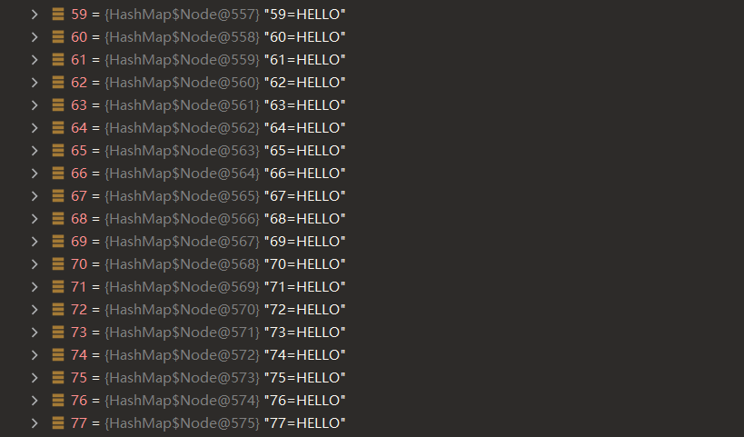


